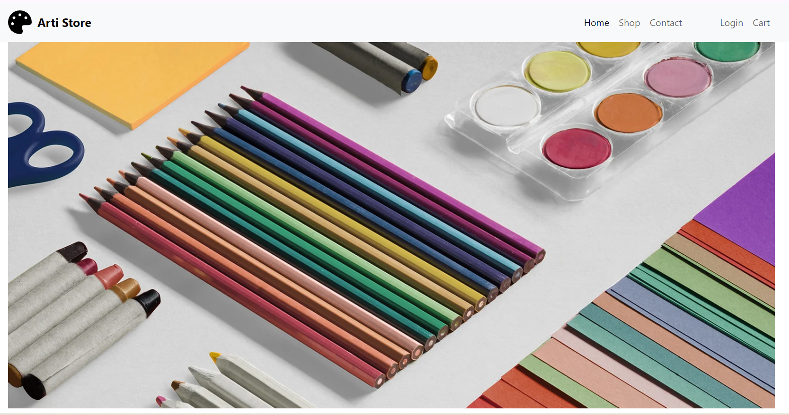

# Arti Store: An Artistic Online Marketplace

## Introduction

Arti Store is your one-stop destination for discovering and purchasing unique, high-quality artwork. This project is a full-stack web application where users can browse, filter, and purchase products from a diverse collection of art. It was built with a passion for blending art and technology to create a seamless online shopping experience for art enthusiasts.

- **Deployed Site:** [Arti Store Live](https://alitahaa.github.io/arti/)
- **Blog Article:** [Final Project Blog](https://www.linkedin.com/feed/update/urn:li:activity:7241925759634706432/)
- **Author's LinkedIn:** [Ali Taha](https://www.linkedin.com/in/ali-taha-944987329)

---

## Inspiration

The inspiration behind Arti Store came from the idea of democratizing access to art. As someone passionate about both art and technology, I wanted to create a platform that could bring these worlds together. Arti Store aims to provide artists with an easy way to showcase their work and allow people worldwide to discover new pieces in a user-friendly online store.

I set out to challenge myself with building an e-commerce platform from scratch, combining a structured frontend design with a robust backend architecture.

---

## Technology & Architecture

Arti Store uses the following technologies:
- **Frontend:** HTML, CSS, Bootstrap for responsive layouts, and JavaScript for interactive features.
- **Backend:** Flask with MySQL for database management and handling user authentication, product data, and orders.
- **Database:** MySQL is used to store user data, product information, and order history.
- **Deployment:** Hosted on github

### System Architecture Overview

The project is divided into three key sections:
- **Frontend:** User interfaces like login, registration, and product display pages.
- **Backend:** Flask manages the APIs for authentication, filtering, and adding products to the cart.
- **Database:** A MySQL relational database that stores information about users, products, and orders.

Here's a quick look at the tech stack:

| Technology   | Role                                      |
|--------------|-------------------------------------------|
| Flask        | Web framework for routing and backend     |
| MySQL        | Database for user and product data        |
| Bootstrap    | For a mobile-responsive, polished UI      |

---

## Core Algorithms and Code Snippets

One of the core functionalities of the platform is the product filtering system. Here's a snippet of how the filter logic was implemented in Flask:

```python
@app.route('/shop', methods=['GET', 'POST'])
def shop():
    if request.method == 'POST':
        category = request.form.get('category')
        price_range = request.form.get('price_range')
        query = "SELECT * FROM products WHERE 1=1"

        if category:
            query += f" AND category = '{category}'"
        if price_range:
            query += f" AND price <= {price_range}"

        products = execute_query(query)
        return render_template('shop.html', products=products)

    return render_template('shop.html')
```

This snippet shows how the app dynamically generates SQL queries based on user input for filtering products by category and price range.

---

## Process, Collaboration, and Timeline

While working on this project, I employed Agile development practices, setting small, achievable milestones to stay on track. I started by mapping out the user journey, from landing on the homepage to adding a product to the cart. After finalizing the architecture and wireframes, I dove into the development of each feature incrementally.

Challenges such as managing database relationships and ensuring a seamless frontend-backend integration took extra time and effort to overcome. However, breaking the work into smaller tasks helped me maintain progress consistently.

---

## Challenges Overcome

One major challenge was setting up a dynamic product filter without slowing down the website. The solution involved optimizing database queries and efficiently handling user input. Another issue was making the UI fully responsive across devices, for which I leveraged Bootstrap's grid system and media queries.

---

## Learnings and Future Iterations

Working on Arti Store reinforced my passion for solving technical problems and building scalable applications. One key takeaway was learning how to optimize MySQL queries for better performance. I also realized the importance of front-end and back-end communication in making the user experience seamless.

For future iterations, I'd like to integrate a more advanced recommendation system using machine learning to suggest products based on user browsing patterns.

---

## Installation

To run this project locally, follow these steps:

1. Clone the repository:
   ```bash
   git clone https://github.com/username/arti-store.git
   ```
2. Navigate to the project directory:
   ```bash
   cd arti-store
   ```
3. Install the required dependencies:
   ```bash
   pip install -r requirements.txt
   ```
4. Set up the database by running the SQL script provided in the `db` directory.

5. Start the Flask development server:
   ```bash
   flask run
   ```

---

## Usage

- **Browse Products:** Use the shop page to browse the collection of available artwork.
- **Login/Register:** Create an account to make purchases.
- **Filter Products:** Narrow down your search using the category and price filters.
- **Add to Cart:** Easily add products to your cart and proceed to checkout.

---

## Contributing

Feel free to open a pull request or issue on the GitHub repository. All contributions are welcome!

---

## Related Projects

- [noon.com](https://www.noon.com/egypt-en/)
- [bluebookstores](https://bluebookstores.com/)

---

## Licensing

This project is licensed under the MIT License.

---

### Resources
- [What your code repository says about you](https://opensource.com/open-organization/17/1/repo-tells-a-story)
- [Awesome List of READMEs](https://github.com/matiassingers/awesome-readme)


## Screenshots

 
